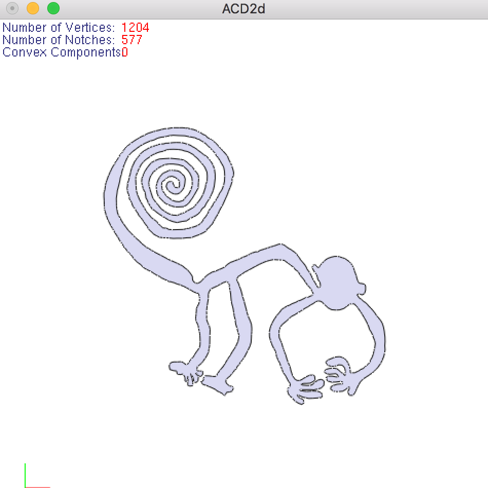
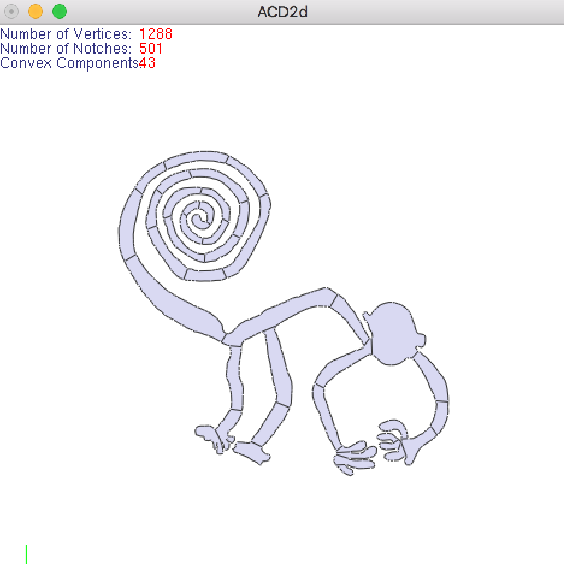

# Approximate Convex Decomposition of Polygons

What is this:

    C++ source code for generating convex approximations of polygons.

 |  
:---: | :---: 

Command line options:

    acd2d_gui [options] simple1.ply

    options:

    -t value            concavity tolerance in the final decomposition
    -m value            specify types of measurements, including sl (straightline), shortestpath (sp), hybrid1 or hybrid2
    -a  value           control cut selection. Large value of "a" biases to cuts with large concavity
    -b  value           control cut selection. Large value of "b" biases to cuts with short length
    -g                  disable OpenGL 
    -s                  save decomposition when OpenGL GUI is disabled
    -ps                 save decomposition to postscript (PS) file (when GUI is disabled)

GUI options (press key):

    d:                  decompose once
    D:                  decompose all
    n:                  show/hide normal direction 
    h:                  show/hide convex hulls
    r:                  reset camera
    space bar:          reload polygon
    s:                  save decomposition
    p:                  save rendering to PS file
    +/-:                zoom in/out
    arrow keys:         translate
    

-- Report bugs to: Jyh-Ming Lien jmlien@cs.gmu.edu
